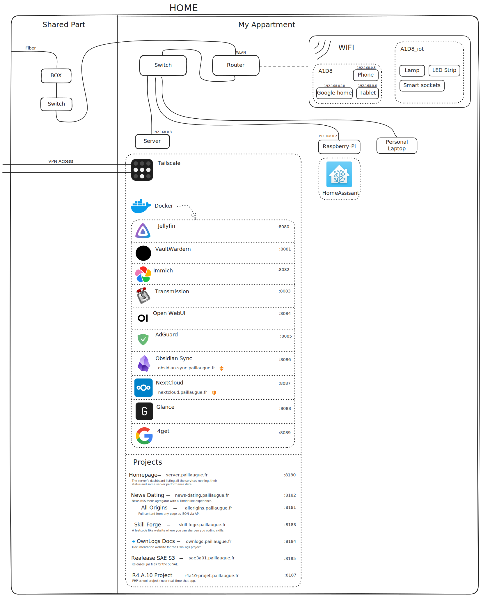

# 🏠 Home Server - Docker Services

This repository manages a collection of self-hosted services running on a single debian 13 server. These services provide local media streaming, DNS filtering, AI tools, cloud storage, and more.

## 🌐 Network Overview
 - **Access**: Local network (`192.168.0.1`)
 - **Remote Access**: Secured using Tailscale, no ports exposed to the public internet.
 - **No Reverse Proxy**: All services are accessed using re-written hostnames thru AdGuard Home (e.g., `service.home.paillaugue.fr`).

<!-- Not up-to-date -->
<!--  -->

## 📦 Services Overview

### 📡 AdGuard Home
 - **Purpose**: DNS-based ad blocker and privacy protection.
 - **UI**: https://adguard.home.paillaugue.fr

### 🎥 Jellyfin
 - **Purpose**: Media server for streaming local content.
 - **UI**: https://jellyfin.home.paillaugue.fr
 - **Mounts**: Movies, Shows
 - **GPU Support**: ~~Yes (via NVIDIA_VISIBLE_DEVICES)~~ I did not manage to pass thru the GPU to the container, so currently no hardware acceleration.

### 🎥 Sonarr
  - **Purpose**: Automated TV show downloader and organizer.
  - **UI**: https://sonarr.home.paillaugue.fr
  - **Mounts**: Shows

### 🎥 Radarr
 - **Purpose**: Automated movie downloader and organizer.
 - **UI**: https://radarr.home.paillaugue.fr
 - **Mounts**: Movies

### 🎥 Bazarr
  - **Purpose**: Subtitle management for Sonarr and Radarr.
  - **UI**: https://bazarr.home.paillaugue.fr
  - **Mounts**: Shows, Movies
  - **Dependencies**: Sonarr, Radarr
  - **Language**: French, English

### 🎥 Jackett
  - **Purpose**: Proxy server for torrent indexers.
  - **UI**: https://jackaett.home.paillaugue.fr

### 🎥 Prowlarr
  - **Purpose**: Indexer manager for Sonarr and Radarr.
  - **UI**: https://prowlarr.home.paillaugue.fr

### Watcharr
 - **Purpose**: Rate and track watched movies and TV shows.
 - **UI**: https://watcharr.home.paillaugue.fr

### 🎥 Jellyseerr
  - **Purpose**: Movie & TV show request manager for Jellyfin.
  - **UI**: https://jellyseerr.home.paillaugue.fr
  - **Dependencies**: Jellyfin, Sonarr, Radarr

### 🧲 Transmission (via VPN)
 - **Purpose**: Torrent client routed through a VPN container (Surfshark with WireGuard).
 - **UI**: https://transmission.home.paillaugue.fr
 - **Network Mode**: Shares network with vpn container.

### 🛡️ VPN (gluetun)
 - **Purpose**: Provides secure VPN tunnel for torrent traffic using WireGuard.
 - **Service Provider**: Surfshark
 - **Exposed Port**: 8083 (Transmission UI proxy)

### 🔐 Vaultwarden
 - **Purpose**: Self-hosted Bitwarden-compatible password manager.
 - **UI**: https://vaultwarden.home.paillaugue.fr

### 🖼️ Immich
 - **Purpose**: Photo and video management (Google Photos alternative).
 - **UI**: https://immich.home.paillaugue.fr
 - **Dependencies**: Redis, PostgreSQL, Machine Learning container
 - **ML Hardware Acceleration**: Enabled via immich-machine-learning:cuda

### 🤖 Open WebUI + Ollama
 - **Purpose**: ChatGPT-like LLM UI backed by Ollama.
 - **UI**: https://openwebui.home.paillaugue.fr
 - **Ollama Port**: 11434 (model serving)

### 🔍 Fourget
 - **Purpose**: Lightweight search engine frontend.
 - **UI**: https://search.home.paillaugue.fr

### 🧭 Glance
 - **Purpose**: Dashboard to visualize and access all services from one place.
 - **UI**: https://homepage.home.paillaugue.fr

### My speed
 - **Purpose**: Network speed test and monitoring.
 - **UI**: https://my-speed.home.paillaugue.fr

### Libre-translate
 - **Purpose**: Self-hosted translation API and UI.
 - **UI**: https://translate.home.paillaugue.fr

### NGINX proxy manager
 - **Purpose**: Manage NGINX reverse proxy with a simple UI.
 - **UI**: https://proxy-manager.home.paillaugue.fr/

### Navidrome
 - **Purpose**: Self-hosted music server and streamer.
 - **UI**: https://navidrome.home.paillaugue.fr/

### Gitea
 - **Purpose**: Self-hosted Git service.
 - **UI**: https://gitea.home.paillaugue.fr/

### NTFY
 - **Purpose**: Simple notification service.
 - **UI**: http://ntfy.home.paillaugue.fr/

### Wikipedia
 - **Purpose**: Self-hosted offline Wikipedia instance (thru kiwix serve).
 - **UI**: https://wikipedia.home.paillaugue.fr/

## 🔐 Remote Access via Tailscale
**Tailscale** is used to securely connect to the home network from outside and installed direclty on the router, allowing full access to LAN devices.

## 🗂️ Media Storage
 - `/dev/nvme0n1` (250GB SSD): unused
 - `/dev/sda` (1TB SSD): system
 - `/dev/sdb` (4TB HDD): storage (ZFS pool)
 - `/dev/sdc` (4TB HDD): unused
 - `/dev/sdd` (2TB HDD): unused
 - `/dev/sde` (4TB HDD): storage (ZFS pool)

## 📎 Additional Notes
 - Transmission is routed through a Surfshark WireGuard VPN via gluetun.
 - Vaultwarden is only accessible within the LAN or via Tailscale for enhanced security.
